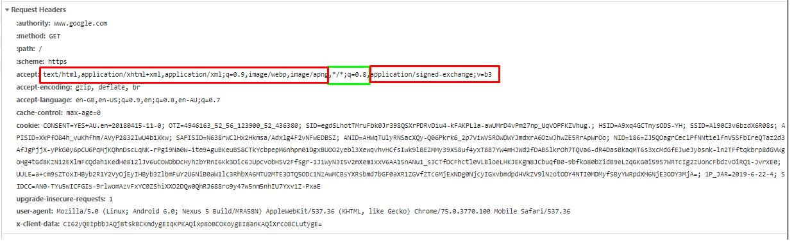

# ASP.NET Core MVC as Api

* By default ASP.NET Core doesn't allow a single controller action to handle request/response for both Mvc and Api requests or allow an Api request to bind to Body + Route/Query. This library allows you to do so plus it also has attributes/conventions/middleware that can be used with [ApiController].

Most useful for the following scenarios:
1. Allowing Developers to Test/Develop/Debug Mvc Forms without worrying about UI. Used by applying conventions.
2. Integration Tests for Mvc without the need of [WebApplicationFactory](https://docs.microsoft.com/en-us/aspnet/core/test/integration-tests?view=aspnetcore-2.2). Used by applying convention.
3. Used in Production to allow specific Mvc controller actions to return model as json/xml data.
4. Used in Production to allow specific Api controller actions to bind to Body + Query/Route.
5. Used in Production to allow Mvc controller actions to return error responses/exceptions as Problem Details.

## Installation

### NuGet
```
PM> Install-Package AspNetCore.Mvc.MvcAsApi
```

### .Net CLI
```
> dotnet add package AspNetCore.Mvc.MvcAsApi
```

## Quick Start
```
services.AddMvc(options =>
{
    options.RespectBrowserAcceptHeader = false;
    options.ReturnHttpNotAcceptable = true;

    if(HostingEnvironment.IsDevelopment())
    {
        options.Conventions.Add(new MvcAsApiConvention());
    }

}).SetCompatibilityVersion(CompatibilityVersion.Version_2_2);

//Optional - These could be used independently of MvcAsApiConvention
if(HostingEnvironment.IsDevelopment())
{
    //MVC Dynamic Model Binding
    services.AddDynamicModelBinder();

    //Api StatusCodeResult Enhanced Problem Details (traceId, timeGenerated, delegate factory)
    services.AddProblemDetailsClientErrorAndExceptionFactory(options => options.ShowExceptionDetails = true);

    //Api Invalid ModelState Enhanced Problem Details (traceId, timeGenerated, delegate factory)
    services.ConfigureProblemDetailsInvalidModelStateFactory();
}
```

## Usage

* Currently to create a controller which handles Api and Mvc requests you would need to write something along the lines of below.

```
[Route("contact")]
[HttpGet]
public IActionResult ContactMvc()
{
    return View(new ContactViewModel());
}

[ValidateAntiForgeryToken]
[Route("contact")]
[HttpPost]
public IActionResult ContactMvc(ContactViewModel viewModel)
{
    if(ModelState.IsValid)
    {
        //Submit Contact Form

        return RedirectToAction("Home");
    }

    return View(viewModel);
}

[ExceptionFilter]
[ErrorFilter]
[Route("api/contact")]
[HttpGet]
public ActionResult<ContactViewModel> ContactApi()
{
    return new ContactViewModel();
}

[ExceptionFilter]
[ErrorFilter]
[Route("api/contact")]
[HttpPost]
public IActionResult ContactApi(ContactViewModel viewModel)
{
    if (ModelState.IsValid)
    {
        //Submit Contact Form
        return Ok();
    }
            
    return ValidationProblem(ModelState);
}
```

* This library give thes ability to add attributes/conventions which allow an Mvc controller action to accpet and return data as if it were an Api action method. An example of the attributes required can be seen below.

```
[MvcExceptionFilter]
[MvcErrorFilter]
[ApiExceptionFilter]
[ApiErrorFilter]
[ViewResultToObjectResult]
[Route("contact")]
[HttpGet]
public IActionResult ContactMvc()
{
    return View(new ContactViewModel());
}

[MvcExceptionFilter]
[MvcErrorFilter]
[ApiExceptionFilter]
[ApiErrorFilter]
[AutoValidateFormAntiForgeryToken]
[Route("contact")]
[HttpPost]
public IActionResult ContactMvc([FromBodyAndModelBinding] ContactViewModel viewModel)
{
    if(ModelState.IsValid)
    {
        //Submit Contact Form

        return RedirectToAction("Home");
    }

    return View(viewModel);
}
```
* There are six conventions which add required binding attributes, handle Api Error Responses/Exceptions, handle Mvc Error Responses/Exceptions and switch [ValidateAntiForgeryToken] > [AutoValidateFormAntiForgeryToken]. This ensures AntiForgeryToken still occurs for Mvc but is bypassed for Api requests.
* The MvcAsApiConvention adds all six conventions in one line of code which is useful for Development.

```
 services.AddMvc(options =>
{
	if(HostingEnvironment.IsDevelopment())
	{
		options.Conventions.Add(new MvcAsApiConvention());
		// OR
		options.Conventions.Add(new MvcAsApiConvention(o =>
		{
			o.MvcErrorOptions = (mvcErrorOptions) => {
	 
			};
			o.MvcExceptionOptions = (mvcExceptionOptions) => {

			};
			o.ApiErrorOptions = (apiErrorOptions) => {

			};
			o.ApiExceptionOptions = (apiExceptionOptions) => {

			};
		}));
		// OR
		//Does nothing by default.
		options.Conventions.Add(new MvcErrorFilterConvention(o => { o.HandleNonBrowserRequests = false; }));
		//Intercepts OperationCanceledException, all other exceptions are logged/handled by UseExceptionHandler/UseDeveloperExceptionPage.
		options.Conventions.Add(new MvcExceptionFilterConvention(o => { o.HandleNonBrowserRequests = false; }));
		//Return problem details in json/xml if an error response is returned via Api.
		options.Conventions.Add(new ApiErrorFilterConvention(o => { o.ApplyToMvcActions = true; o.ApplyToApiControllerActions = true; }));
		//Return problem details in json/xml if an exception is thrown via Api
		options.Conventions.Add(new ApiExceptionFilterConvention(o => { o.ApplyToMvcActions = true; o.ApplyToApiControllerActions = true; }));
		//Post data to MVC Controller from API
		options.Conventions.Add(new FromBodyAndOtherSourcesConvention(o => { o.ApplyToMvcActions = true; o.ApplyToApiControllerActions = true; o.EnableForParametersWithNoBinding = true; o.EnableForParametersWithFormRouteQueryBinding = true; o.ChangeFromBodyBindingsToFromBodyFormAndRouteQueryBinding = true; }));
		//Return data uisng output formatter when acccept header is application/json or application/xml
		options.Conventions.Add(new ConvertViewResultToObjectResultConvention(o => { o.ApplyToMvcActions = true; o.ApplyToApiControllerActions = true; }));

	}
}).SetCompatibilityVersion(CompatibilityVersion.Version_2_2);

//Optional
if(HostingEnvironment.IsDevelopment())
{
    //Api StatusCodeResult Enhanced Problem Details (traceId, timeGenerated, delegate factory)
    services.AddProblemDetailsClientErrorAndExceptionFactory(options => options.ShowExceptionDetails = true);

    //Api Invalid ModelState Enhanced Problem Details (traceId, timeGenerated, delegate factory)
    services.ConfigureProblemDetailsInvalidModelStateFactory();
}

[Route("contact")]
[HttpGet]
public IActionResult ContactMvc()
{
    return View(new ContactViewModel());
}

[ValidateAntiForgeryToken]
[Route("contact")]
[HttpPost]
public IActionResult ContactMvc(ContactViewModel viewModel)
{
    if(ModelState.IsValid)
    {
        //Submit Contact Form

        return RedirectToAction("Home");
    }

    return View(viewModel);
}
```

* By default only [JsonInputFormatter](https://github.com/aspnet/Mvc/blob/master/src/Microsoft.AspNetCore.Mvc.Formatters.Json/JsonInputFormatter.cs) binds dynamic as JObject. [ComplexTypeModelBinderProvider](https://github.com/aspnet/AspNetCore/blob/c565386a3ed135560bc2e9017aa54a950b4e35dd/src/Mvc/Mvc.Core/src/ModelBinding/Binders/ComplexTypeModelBinder.cs) doesn't bind to dynamic so I have created an additional optional ModelBinder which allows the same functionality for Mvc.
* https://github.com/aspnet/AspNetCore/issues/1748
* https://stackoverflow.com/questions/9450619/using-dynamic-objects-with-asp-net-mvc-model-binding

```
//Optional
services.AddDynamicModelBinder();

[Route("contact")]
[HttpGet]
public IActionResult ContactMvc()
{
    return View(new ContactViewModel());
}

[ValidateAntiForgeryToken]
[Route("contact")]
[HttpPost]
public IActionResult ContactMvc(dynamic viewModel)
{
	if (ModelState.IsValid)
	{
		return RedirectToAction(nameof(Index));
	}

	var viewModel = contactViewModel.ToObject<ContactViewModel>();

	return View(viewModel);
}
```

## Content Negotiation
* See [Content Negotiation Process documentation](https://docs.microsoft.com/en-us/aspnet/core/web-api/advanced/formatting?view=aspnetcore-2.2)
* By default MvcOptions.RespectBrowserAcceptHeader is set to false which means when you hit an Api from your web browser and it contains accept header '\*/*' the other accept headers are completely ignored.
* This library uses the same logic to distinguish Browser and Non-Browser requests in order to return ViewResult (Browser request) or ObjectResult (Non-Browser request).
* Below is a typical browser request showing that most of the accept headerers are actually ignored.



```
 services.AddMvc(options =>
{	//Default = false. 
	//If the Request contains Accept header '*/*' the server ignores the Accept headers completely and uses the first output formatter that can format the object (usually json). 
	//For example when you hit an Api from a web browser.
	options.RespectBrowserAcceptHeader = false;
	
	//Default = false but good practice to set this to true.
	//If the Request does not contain Accept header '*/*' the server MUST find an output formatter based on accept header otherwise return statuscode 406 Not Acceptable. 
	//For example when making a json/xml/yaml request from postman. 
	//If this is left as false and request is sent in with accept header 'application/x-yaml', if the server doesn't have a yaml formatter it would use the first output formatter that can format the object (usually json) which is confusing for the client.
	options.ReturnHttpNotAcceptable = true;
}).SetCompatibilityVersion(CompatibilityVersion.Version_2_2);
```

## Error Responses (Status Code >= 400) and Exceptions - MVC Filters
* Api Controller Action error responses (Status Code >= 400) and Exceptions will be handled with these filters. 
* The [ApiErrorFilterAttribute] is gives similar functionality to the [ClientErrorResultFilter](https://github.com/aspnet/AspNetCore/blob/c565386a3ed135560bc2e9017aa54a950b4e35dd/src/Mvc/Mvc.Core/src/Infrastructure/ClientErrorResultFilter.cs) that is applied when a controller is decorated with [ApiController](https://docs.microsoft.com/en-us/aspnet/core/web-api/?view=aspnetcore-2.2#multipartform-data-request-inference) but gives the ability to pass in a decision delegate.
* The [ApiExceptionFilterAttribute] allows api exceptions to be handled.
* The [MvcExceptionFilterAttribute] allows browser request exceptions to be handled.
* For handling [404 route not found and exceptions](https://github.com/aspnet/AspNetCore/issues/4953) from other middleware you will need to implement Global Exception Handling. See below.
* IClientErrorFactory will handle generating the problem details when an Error Response occurs. See default [ProblemDetailsClientErrorFactory](https://github.com/aspnet/AspNetCore/blob/c565386a3ed135560bc2e9017aa54a950b4e35dd/src/Mvc/Mvc.Core/src/Infrastructure/ProblemDetailsClientErrorFactory.cs).
* An enhanced IClientErrorFactory can be used as this adds traceId, timeGenerated and also handles generating the problem details when an exception is thrown. 
* Use [ConfigureApiBehaviorOptions to configure problem detail type and title mapping](https://docs.microsoft.com/en-us/aspnet/core/web-api/?view=aspnetcore-2.2).

```
services.AddProblemDetailsClientErrorAndExceptionFactory(options => options.ShowExceptionDetails = true);
```

| Attribute                     | Description                                                                                                                                                                                                                                                                                                                                     |
|:------------------------------|:------------------------------------------------------------------------------------------------------------------------------------------------------------------------------------------------------------------------------------------------------------------------------------------------------------------------------------------------|
| [ApiErrorFilterAttribute]     | Return problem details in json/xml if an error response is returned from Controller Action. The parameter handleBrowserRequests allows the attribute to be used on Mvc actions by passing false and [ApiController] actions by passing true.                                                                                                    |
| [ApiExceptionFilterAttribute] | Converts exception to an Error Response of type ExceptionResult:StatusResult if an exception is thrown from Controller Action. The ApiErrorFilterAttribute can then handle the Error Response. The parameter handleBrowserRequests allows the attribute to be used on Mvc actions by passing false and [ApiController] actions by passing true. |
| [MvcErrorFilterAttribute]     | Does nothing by default. The parameter handleNonBrowserRequests allows the attribute to be used on MvcAsApi actions by passing false and Mvc actions by passing true.                                                                                                                                                                           |
| [MvcExceptionFilterAttribute] | Intercepts OperationCanceledException and returns 499, all other exceptions are logged/handled by UseExceptionHandler/UseDeveloperExceptionPage.                                                                                                                                                                                                                |


* Example Error Response
```
{
    "type": "about:blank",
    "title": "",
    "status": 450,
    "instance": "/new/contact",
    "traceId": "0HLNK5EJKEF4K:00000001",
    "timeGenerated": "2019-06-18T20:33:46.6609813Z"
}
```

* Example Exception Response
```
{
    "type": "about:blank",
    "title": "An error has occured.",
    "status": 500,
    "detail": "System.Exception: Test\r\n   at DynamicForms.Web.Controllers.ApiFormController.Contact() in C:\\Development\\DynamicForms\\src\\DynamicForms.Web\\Controllers\\ApiFormController.cs:line 85\r\n   at lambda_method(Closure , Object , Object[] )\r\n   at Microsoft.Extensions.Internal.ObjectMethodExecutor.Execute(Object target, Object[] parameters)\r\n   at Microsoft.AspNetCore.Mvc.Internal.ActionMethodExecutor.SyncActionResultExecutor.Execute(IActionResultTypeMapper mapper, ObjectMethodExecutor executor, Object controller, Object[] arguments)\r\n   at Microsoft.AspNetCore.Mvc.Internal.ControllerActionInvoker.InvokeActionMethodAsync()\r\n   at Microsoft.AspNetCore.Mvc.Internal.ControllerActionInvoker.InvokeNextActionFilterAsync()\r\n   at Microsoft.AspNetCore.Mvc.Internal.ControllerActionInvoker.Rethrow(ActionExecutedContext context)\r\n   at Microsoft.AspNetCore.Mvc.Internal.ControllerActionInvoker.Next(State& next, Scope& scope, Object& state, Boolean& isCompleted)\r\n   at Microsoft.AspNetCore.Mvc.Internal.ControllerActionInvoker.InvokeInnerFilterAsync()\r\n   at Microsoft.AspNetCore.Mvc.Internal.ResourceInvoker.InvokeNextExceptionFilterAsync()",
    "instance": "/new/contact",
    "traceId": "0HLNK5EJKEF4H:00000002",
    "timeGenerated": "2019-06-18T20:31:36.9343306Z"
}
```

## Global Error Responses (Status Code >= 400) and Exceptions - Middleware
* Catches [404 error responses when route is not found and exceptions from MVC and other middleware](https://github.com/aspnet/AspNetCore/issues/4953).
* Usually would use MVC Filters OR Global Error/Exception handling but not both. It will work with both though.
* Using [WebAPIContrib.Core](https://github.com/WebApiContrib/WebAPIContrib.Core) to allow the use of action results and content negotiation outside of MVC if MVC services are in DI container. Otherwise serialized to json.
* Use [ConfigureApiBehaviorOptions to configure problem detail type and title mapping](https://docs.microsoft.com/en-us/aspnet/core/web-api/?view=aspnetcore-2.2).
* The ProblemDetailsErrorResponseHandler by default only looks at responses with no content-type and no body. If used with Mvc it would only intercept StatusCodeResult but not ObjectResult.
* There is an option to intercept content responses also but will need to enable option HandleContentResponses which uses a [RecyclableMemoryStream](https://github.com/microsoft/Microsoft.IO.RecyclableMemoryStream) rather than new MemoryStream() to improve application performance.
* In order to skip the error handler set httpContext.Items["SkipProblemDetailsErrorResponseHandler"] = true; within middleware. 

```
if (!env.IsProduction())
{
	// Non Api
	app.UseWhen(context => context.Request.IsMvc(),
		appBranch =>
		{
			appBranch.UseDeveloperExceptionPage();
		}
   );

	// Web Api
	 app.UseWhen(context => context.Request.IsApi(),
		appBranch =>
		{
			appBranch.UseProblemDetailsExceptionHandler(options => options.ShowExceptionDetails = true);
			appBranch.UseProblemDetailsErrorResponseHandler();
		}
   );

	app.UseDatabaseErrorPage();
}
else
{
	// Non Api
	app.UseWhen(context => context.Request.IsMvc(),
		 appBranch =>
		 {
			 appBranch.UseExceptionHandler("/Error");
		 }
	);

	// Web Api
	 app.UseWhen(context => context.Request.IsApi(),
			appBranch =>
			{
				appBranch.UseProblemDetailsExceptionHandler(options => options.ShowExceptionDetails = false);
				appBranch.UseProblemDetailsErrorResponseHandler();
			}
	   );
   
   app.UseHsts();
}
```

* Example 404 Response
```
{
    "type": "https://tools.ietf.org/html/rfc7231#section-6.5.4",
    "title": "Not Found",
    "status": 404,
    "instance": "/new/test",
    "traceId": "0HLNK4OD71ENJ:00000004",
    "timeGenerated": "2019-06-18T20:04:50.3110301Z"
}
```

* Example Exception Response
```
{
    "type": "about:blank",
    "title": "An error has occured.",
    "status": 500,
    "detail": "System.Exception: Test\r\n   at DynamicForms.Web.Controllers.ApiFormController.Contact() in C:\\Development\\DynamicForms\\src\\DynamicForms.Web\\Controllers\\ApiFormController.cs:line 85\r\n   at lambda_method(Closure , Object , Object[] )\r\n   at Microsoft.Extensions.Internal.ObjectMethodExecutor.Execute(Object target, Object[] parameters)\r\n   at Microsoft.AspNetCore.Mvc.Internal.ActionMethodExecutor.SyncActionResultExecutor.Execute(IActionResultTypeMapper mapper, ObjectMethodExecutor executor, Object controller, Object[] arguments)\r\n   at Microsoft.AspNetCore.Mvc.Internal.ControllerActionInvoker.InvokeActionMethodAsync()\r\n   at Microsoft.AspNetCore.Mvc.Internal.ControllerActionInvoker.InvokeNextActionFilterAsync()\r\n   at Microsoft.AspNetCore.Mvc.Internal.ControllerActionInvoker.Rethrow(ActionExecutedContext context)\r\n   at Microsoft.AspNetCore.Mvc.Internal.ControllerActionInvoker.Next(State& next, Scope& scope, Object& state, Boolean& isCompleted)\r\n   at Microsoft.AspNetCore.Mvc.Internal.ControllerActionInvoker.InvokeInnerFilterAsync()\r\n   at Microsoft.AspNetCore.Mvc.Internal.ResourceInvoker.InvokeNextResourceFilter()\r\n   at Microsoft.AspNetCore.Mvc.Internal.ResourceInvoker.Rethrow(ResourceExecutedContext context)\r\n   at Microsoft.AspNetCore.Mvc.Internal.ResourceInvoker.Next(State& next, Scope& scope, Object& state, Boolean& isCompleted)\r\n   at Microsoft.AspNetCore.Mvc.Internal.ResourceInvoker.InvokeFilterPipelineAsync()\r\n   at Microsoft.AspNetCore.Mvc.Internal.ResourceInvoker.InvokeAsync()\r\n   at Microsoft.AspNetCore.Routing.EndpointMiddleware.Invoke(HttpContext httpContext)\r\n   at Microsoft.AspNetCore.Routing.EndpointRoutingMiddleware.Invoke(HttpContext httpContext)\r\n   at Microsoft.AspNetCore.StaticFiles.StaticFileMiddleware.Invoke(HttpContext context)\r\n   at Microsoft.AspNetCore.Diagnostics.EntityFrameworkCore.MigrationsEndPointMiddleware.Invoke(HttpContext context)\r\n   at Microsoft.AspNetCore.Diagnostics.EntityFrameworkCore.DatabaseErrorPageMiddleware.Invoke(HttpContext httpContext)\r\n   at Microsoft.AspNetCore.Diagnostics.EntityFrameworkCore.DatabaseErrorPageMiddleware.Invoke(HttpContext httpContext)\r\n   at AspNetCore.Mvc.HybridModelBindingAndViewToObjectResult.Middleware.ApiGlobalErrorResponseProblemDetailsMiddleware.InvokeAsync(HttpContext context) in C:\\Development\\HybridModelBindingAndViewToObjectResult\\src\\AspNetCore.Mvc.HybridModelBindingAndViewToObjectResult\\Middleware\\ApiGlobalErrorResponseProblemDetailsMiddleware.cs:line 34\r\n   at Microsoft.AspNetCore.Diagnostics.ExceptionHandlerMiddleware.Invoke(HttpContext context)",
    "instance": "/new/contact",
    "traceId": "0HLNK55N49JII:00000002",
    "timeGenerated": "2019-06-18T20:13:39.6308515Z"
}
```

## Authorization 

| Attribute                                   | Description                                                                        |
|:--------------------------------------------|:-----------------------------------------------------------------------------------|
| [AutoValidateFormAntiforgeryTokenAttribute] | Ensures only Post requests with Form content-type is checked for AntiForgeryToken. |


## Model Binding Attributes
* https://docs.microsoft.com/en-us/aspnet/core/mvc/models/model-binding?view=aspnetcore-2.2
* https://andrewlock.net/model-binding-json-posts-in-asp-net-core/
* https://stackoverflow.com/questions/45495432/asp-net-core-mvc-mixed-route-frombody-model-binding-validation
* https://github.com/billbogaiv/hybrid-model-binding

| Attribute                                                                  | Description                                                                                   |
|:---------------------------------------------------------------------------|:----------------------------------------------------------------------------------------------|
| [FromBodyOrFormAttribute]                                                  | Binds Model to Body or Form                                                                   |
| [FromBodyOrQueryAttribute]                                                 | Binds Model to Body or Query                                                                  |
| [FromBodyOrRouteAttribute]                                                 | Binds Model to Body or Route                                                                  |
| [FromBodyOrFormRouteQueryAttribute] or [FromBodyOrModelBindingAttribute]   | Binds Model to Body or Form/Route/Query                                                       |
| [FromBodyAndQueryAttribute]                                                | Binds Model to Body and Query                                                                 |
| [FromBodyAndRouteAttribute]                                                | Binds Model to Body and Route                                                                 |
| [FromBodyFormAndRouteQueryAttribute] or [FromBodyAndModelBindingAttribute] | Binds Model to Body/Form and Route/Query                                                      |
| [FromBodyExplicitAttribute]                                                | If conventions are used to change [FromBody] attributes this can be used to prevent doing so. |

## Model Binding Dynamic Mvc
* By default only [JsonInputFormatter](https://github.com/aspnet/Mvc/blob/master/src/Microsoft.AspNetCore.Mvc.Formatters.Json/JsonInputFormatter.cs) binds dynamic as JObject. [ComplexTypeModelBinderProvider](https://github.com/aspnet/AspNetCore/blob/c565386a3ed135560bc2e9017aa54a950b4e35dd/src/Mvc/Mvc.Core/src/ModelBinding/Binders/ComplexTypeModelBinder.cs) doesn't bind to dynamic so I have created an additional optional ModelBinder which allows the same functionality for Mvc.
* https://github.com/aspnet/AspNetCore/issues/1748
* https://stackoverflow.com/questions/9450619/using-dynamic-objects-with-asp-net-mvc-model-binding
```
services.AddDynamicModelBinder();
			
 public IActionResult Dynamic()
{
	return View(new ContactViewModel());
}

[ValidateAntiForgeryToken]
[HttpPost]
public IActionResult Dynamic(dynamic contactViewModel)
{
	if (ModelState.IsValid)
	{
		return RedirectToAction(nameof(Index));
	}

	var viewModel = contactViewModel.ToObject<ContactViewModel>();

	return View(viewModel);
}
```

## Invalid Model State
* I recommend using options.ConfigureProblemDetailsInvalidModelStateFactory() as this adds traceId and timeGenerated to the Invalid Model State Problem Details and also differentiates between 422 and 400 responses. 400 returned if action parameters are missing otherwise 422 returned.
* There is an option to add angular formatted errors to the Invalid Model State Problem Details also.

```
 services.ConfigureProblemDetailsInvalidModelStateFactory(options => options.EnableAngularErrors = true);
```

* Example invalid ModelState response
```
{
    "errors": {
        "Name": [
            "The Name field is required."
        ]
    },
    "type": "https://tools.ietf.org/html/rfc7231#section-6.5.1",
    "title": "One or more validation errors occurred.",
    "status": 422,
    "detail": "Please refer to the errors property for additional details.",
    "instance": "/home/contact",
    "traceId": "8000003d-0006-fd00-b63f-84710c7967bb",
    "timeGenerated": "2019-06-18T21:18:03.7548395Z"
}
```

* Example invalid ModelState response with Angular formatted errors
```
{
    "errors": {
        "Email": [
            "The Email field is not a valid e-mail address."
        ]
    },
    "type": "https://tools.ietf.org/html/rfc4918#section-11.2",
    "title": "One or more validation errors occurred.",
    "status": 422,
    "detail": "Please refer to the errors property for additional details.",
    "instance": "/api/values",
    "angularErrors": {
        "Email": [
            {
                "validatorKey": "",
                "message": "The Email field is not a valid e-mail address."
            }
        ]
    },
    "traceId": "80000006-0002-f900-b63f-84710c7967bb",
    "timeGenerated": "2019-06-21T20:12:37.44671Z"
}
```

## Output Formatting Attributes

| Attribute                                  | Description                                                                                          |
|:-------------------------------------------|:-----------------------------------------------------------------------------------------------------|
| [ConvertViewResultToObjectResultAttribute] | Converts ViewResult to ObjectResult when Accept header matches output formatter SupportedMediaTypes. |


## Conventions

| Convention                                | Description                                                                                                                                                                                                                                                                   |
|:------------------------------------------|:------------------------------------------------------------------------------------------------------------------------------------------------------------------------------------------------------------------------------------------------------------------------------|
| ApiErrorFilterConvention                  | Adds ApiErrorFilterAttribute to Controller Actions.                                                                                                                                                                                                                           |
| ApiErrorExceptionFilterConvention         | Adds ApiExceptionFilterAttribute to Controller Actions.                                                                                                                                                                                                                       |
| MvcErrorFilterConvention                  | Adds MvcErrorFilterAttribute to non [ApiController] Actions.                                                                                                                                                                                                                  |
| MvcErrorExceptionFilterConvention         | Adds MvcExceptionFilterAttribute to non [ApiController] Actions.                                                                                                                                                                                                              |
| FromBodyAndOtherSourcesConvention         | Adds required attributes to all Controllers, Actions and Parameters. Good for Development environment. In production only recommending passing true for first argument which applies convention to params with no binding source.                                             |
| FromBodyOrOtherSourcesConvention          | Adds required attributes to all Controllers, Actions and Parameters. Good for Development environment. In production only recommending passing true for first argument which applies convention to params with no binding source.                                             |
| ConvertViewResultToObjectResultConvention | Adds ConvertViewResultToObjectResultAttribute to all Controller Actions.                                                                                                                                                                                                      |
| MvcAsApiConvention                        | Adds ApiErrorFilterConvention, ApiErrorExceptionFilterConvention, FromBodyOrOtherSourcesConvention and ConvertViewResultToObjectResultConvention to all Controller Actions.  Adds MvcErrorFilterConvention, MvcErrorExceptionFilterConvention to non [ApiController] Actions. |
| MvcConvention                             | Adds MvcErrorFilterConvention, MvcErrorExceptionFilterConvention to non [ApiController] Actions.                                                                                                                                                                              |
| ApiConvention                             | Adds ApiErrorFilterConvention, ApiErrorExceptionFilterConvention, FromBodyOrOtherSourcesConvention and ConvertViewResultToObjectResultConvention to [ApiController] Actions.                                                                                                  |

                                                                          
## Api Response
* If Accept Header matches OutputFormatter Supported Media Type and the ModelState is Valid, ViewResult is Converted to ObjectResult.
* If Accept Header matches OutputFormatter Supported Media Type and the ModelState is Valid, ApiBehaviorOptions InvalidModelStateResponseFactory delegate is called which by default returns [ValidationProblemDetails](https://github.com/aspnet/AspNetCore/blob/c565386a3ed135560bc2e9017aa54a950b4e35dd/src/Mvc/Mvc.Core/src/DependencyInjection/ApiBehaviorOptionsSetup.cs). [See web API Documentation](https://docs.microsoft.com/en-us/aspnet/core/web-api/?view=aspnetcore-2.2)
* If an error response or exception is thrown ProblemDetails are returned.


## Authors

* **Dave Ikin** - [davidikin45](https://github.com/davidikin45)


## License

This project is licensed under the MIT License

## Acknowledgments

* [HybridModelBinding](https://github.com/billbogaiv/hybrid-model-binding)
* [Hellang.Middleware.ProblemDetails](https://github.com/khellang/Middleware)
* [RFC 7807 - Problem Details for HTTP APIs](https://tools.ietf.org/html/rfc7807)